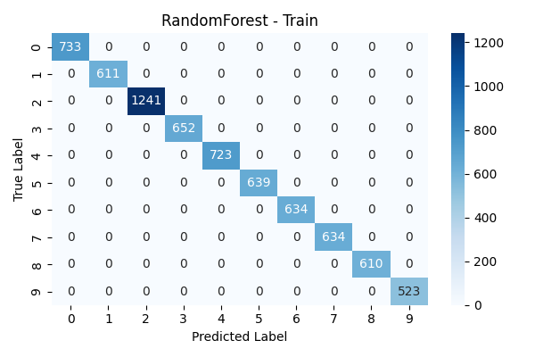
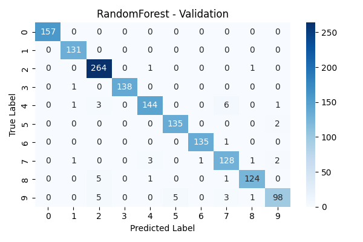
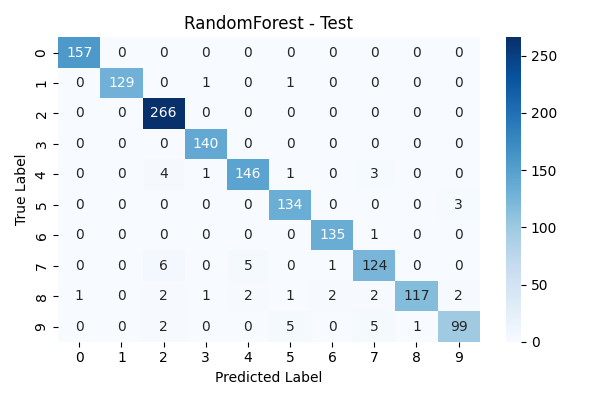
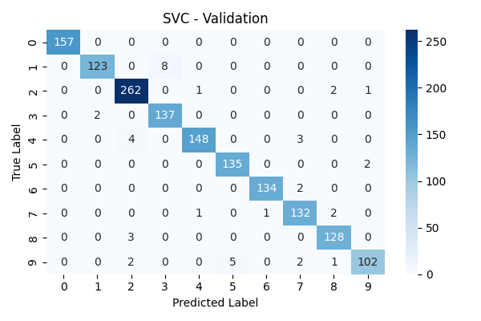
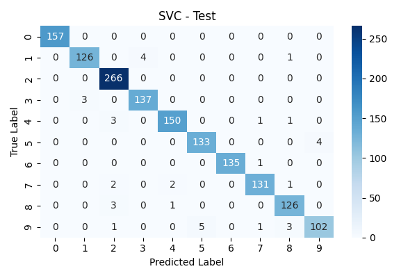

# HotelAtlas
**Welcome to HotelAtlas, where Machine Learning meets your next vacation spot.**

In this project, i’m unleashing the full power of Machine Learning magic, both Supervised and Unsupervised, plus some SQL wizardry, all to decode the mysteries hidden in a massive hotel dataset.

I guess now you know why i named it HotelAtlas as our journey needs to dive into the world of math and many different algorithms so we need an atlas.

The dataset consists of approximately 85,000 records detailing various hotel attributes.

This project includes the following key components:

- Conducting thorough Exploratory Data Analysis (EDA) and data cleaning to ensure data quality and consistency.

- Applying unsupervised learning methods to segment hotels into distinct clusters based on their features and amenities.

- Building supervised learning models to predict hotel ratings effectively.

- Utilizing SQL queries for data aggregation, ranking, and enrichment to support deeper analysis.

Through HotelAtlas, the goal is to provide actionable insights into customer segments and customers stuff using into the hotels using machine learning and data engineering practices.

## Project Structure
<pre>
HotelAtlas/
│
├── assets/
│   ├── configs.py
│   ├── utils.py
|   
├── datasets
│   ├── row_hotels_dataset.xlsx
│   ├── cleaned_hotels_dataset.xlsx
│   ├── segmented_customers_dataset.xlsx
|
├── jupyter_notebooks/
│   ├── hotel_eda_report.ipynb
│   ├── customer_segmentation.ipynb
|
├── model_results/
│   ├── RandomForest/
|   |   ├── metrics.json
|   |   ├── ...
│   ├── SVC/
|   |   ├── metrics.json# Close connection
|   |   ├── ...
|
├── sqlite/
│   ├── queries.py
|
├── src/
│   ├── train.py
|
├── run.sh
|
├── README.md    
|
├── LICENCE
|
├── requirements.txt
|
├── .gitignore
</pre>

## Get Started
### 1. Python & Environment Setup
- I suggest using python >= 3.10
- Create your conda environment
    ```bash
    $ conda create --name env-name python==3.10
    ```
- Activate your environment
    ```bash
    $ conda activate env-name
    ```
### 2. Install Dependencies
```bash
$ pip install -r requirements.txt
```

## Download Trained Models
This guide shows how to download a file from Google Drive using Python and the [`gdown`](https://github.com/wkentaro/gdown) library.

---

#### 1. Install Requirements

```bash
pip install gdown
```
---

#### 2. Python Script

```python
import gdown

file_id = "1RKoGGyz7dV7lWADXs5FunwVydfDFw6lN"

url = f"https://drive.google.com/uc?id={file_id}"

output = "trained_models.zip" 

gdown.download(url, output, quiet=False)
```

## Train Your Own Models
```bash
$ chmod +x run.sh
$ ./run.sh
```

## **Produced Reports**
### **`Hotel EDA Notebook`**

This notebook(`jupyter_notebooks/hotel_eda_report.ipynb`) contains an **Exploratory Data Analysis (EDA)** on hotel-related data, aiming to uncover patterns, and insights that can support decision-making and further modeling.

#### Objectives
- Understand the structure and quality of the dataset.
- Identify missing values and data inconsistencies.
- Explore patterns in data features.
- Analyze customer segemnts.
- Visualize key relationships between features.

### Results
- **Cleaned version of dataset** that can be used for different machine learning approaches. 
- Cleaned version of dataset saved into the `datasets/cleaned_hotels_dataset.xlsx`


### **`Customer Segmentation Notebook`**

This notebook(`jupyter_notebooks/customer_segmentation.ipynb`) contains a **Clustering Analysis** on hotel-related data that cleaned and preprocessed in the previous step.

#### Objectives
- Find the best number of clusters to segment customers.
- Apply dimentinality reduction algorithms to help in visualizing and clustering customers segments.
- Apply different clustering algorithms to segment customers.
- Save the best clustering results.

### Results
- A high quality produced **Customer Segmentation Dataset** that contains features related to customer segments with labels.
- The dataset saved into the `datasets/segmented_customers_dataset.xlsx`

### **`Classify Customer Segments`**
This implements a **machine learning training pipeline** for customer segmentation using **Random Forest** and **Support Vector Classifier (SVC)**.  
The dataset is preprocessed, split into **training**, **validation**, and **test** sets, scaled with `StandardScaler`, and then fed into the models.  
The pipeline produces **evaluation metrics** and **visualizations** for better model interpretability.

### Objectives
- Load and preprocess customer segmentation data from an Excel file.
- Split the dataset into training, validation, and test sets.
- Apply feature scaling using `StandardScaler`.
- Train two classification models:
  - Random Forest Classifier
  - Support Vector Classifier (SVC)
- Evaluate models using:
  - Accuracy, Precision, Recall, F1-Score
  - Confusion Matrix
  - Classification Report

### Results
- Saved results, models, and visualizations for further analysis.
- The models accuracy are pretty amazing 

## Detailed Observations

###  Random Forest Algorithm

#### Results Summary

| Dataset       | Accuracy  | Precision (Weighted) | Recall (Weighted) | F1-score (Weighted) |
|---------------|-----------|----------------------|-------------------|---------------------|
| **Train**     | 1.0000    | 1.0000               | 1.0000            | 1.0000              |
| **Validation**| 0.9693    | 0.9695               | 0.9693            | 0.9676              |
| **Test**      | 0.9647    | 0.9648               | 0.9647            | 0.9626              |


### **1. Training Set**
- **Perfect scores** across all metrics.
- Confusion matrix shows no misclassifications.

### **2. Validation Set**
- Accuracy: **96.93%**
- Most errors occur in classes **4**, **7**, **8**, and **9**.
- Example:
  - Class **4** recall: **92.9%**
  - Class **7** precision: **92.1%**
  - Class **9** recall: **87.5%**

### **3. Test Set**
- Accuracy: **96.47%** (close to validation → stable generalization).
- Lower recall for:
  - Class **7** → 91.2%
  - Class **8** → 90.0%
  - Class **9** → 88.4%

---

### Confusion Matrix Visuals
Confusion matrices for **train**, **validation**, and **test** datasets are saved as images in `model_results/RandomForest`:

<table>
<tr>
<td></td>
<td></td>
<td></td>
</tr>
<tr>
<td><p align="center">Train Set</p></td>
<td><p align="center">Validation Set</p></td>
<td><p align="center">Test Set</p></td>
</tr>
</table>

## Support Vector Classifier (SVC) Algorithm

### Results Summary

| Dataset       | Accuracy  | Precision (Weighted) | Recall (Weighted) | F1-score (Weighted) |
|---------------|-----------|----------------------|-------------------|---------------------|
| **Train**     | 0.9827    | 0.9829               | 0.9827            | 0.9827              |
| **Validation**| 0.9720    | 0.9723               | 0.9720            | 0.9719              |
| **Test**      | 0.9753    | 0.9754               | 0.9753            | 0.9752              |

---

### 1. Training Set
- Accuracy: **98.27%** with balanced precision and recall.
- Most classes show near-perfect classification.
- Minor confusion observed in classes **1**, **3**, **4**, **5**, **7**, **8**, and **9**, but all under 3% error.

### 2. Validation Set
- Accuracy: **97.20%**  
- Strong generalization with minimal drop from training.
- Most errors occur in:
  - **Class 9** → Recall: **91.07%**
  - **Class 7** → Recall: **97.05%**, but some misclassifications with class 8.
  - **Class 4** → Recall: **95.48%**
- Overall, confusion is mostly between visually similar classes.

### 3. Test Set
- Accuracy: **97.53%** (slightly higher than validation).
- High stability between validation and test results.
- Lower recall in:
  - **Class 9** → 91.07%
  - **Class 8** → 96.92%
  - **Class 7** → 96.32%
- Consistent pattern of misclassification with certain class pairs.

---

### Confusion Matrix Visuals
Confusion matrices for **train**, **validation**, and **test** datasets are saved as images in `model_results/SVC`:

<table>
<tr>
<td></td>
<td></td>
<td></td>
</tr>
<tr>
<td align="center">Train Set</td>
<td align="center">Validation Set</td>
<td align="center">Test Set</td>
</tr>
</table>

## What's Next:
- Implementing an ANN from scratch customized to the classification task and see it's results.
- For production purposes:
    - Creating an OOP classes that serve clustering and classification includes their needed methods like   ```clsuer() or classify()```.
    - An endpoints to host these models, for example using FastAPI.
    - Create two seperated services one for clustering and the other one for classification.
    - Use docker stack deploy to deploy these two services.
    - Test the whole pipeline.
- We can use provided python pipelines for process sequential preprocessing one at a time.

-- Just ended for now, but not at all ((: